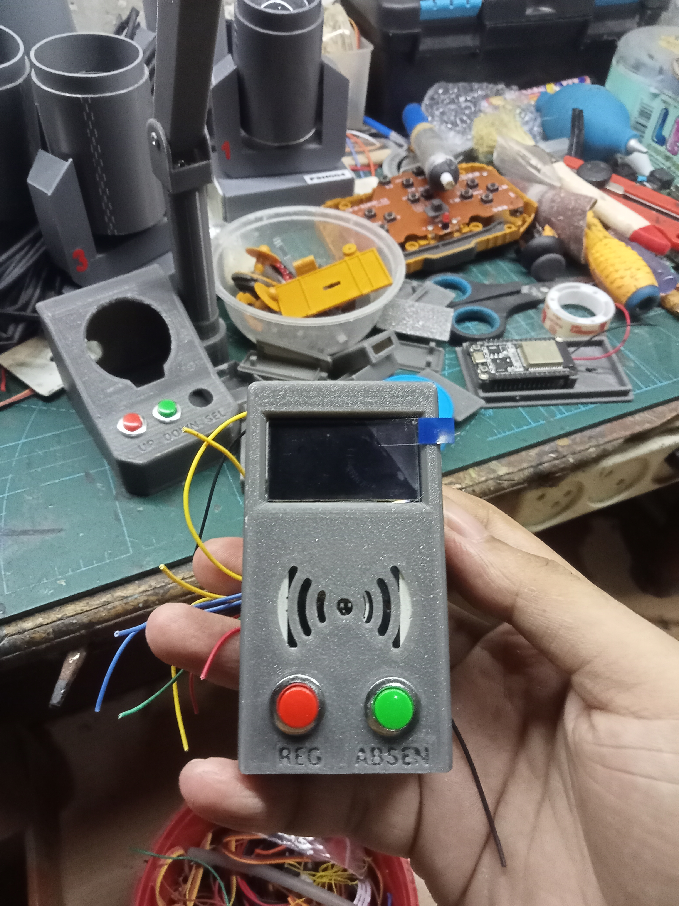
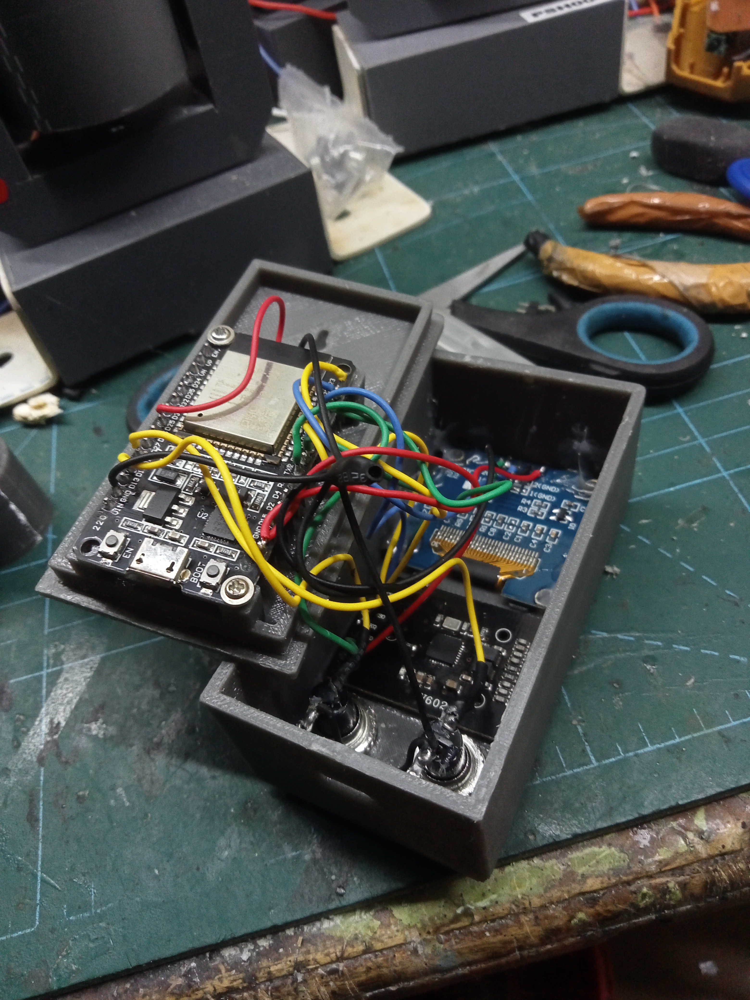

# 🪪 AbsensiESP32 — Sistem Absensi RFID Berbasis ESP32

Sistem absensi digital menggunakan **ESP32 + RFID RC522** dengan tampilan OLED, dashboard web real-time via WebSocket, dan penyimpanan data persisten menggunakan **LittleFS**. Cukup tempelkan kartu RFID, absensi langsung tercatat dan tampil di browser!

---

## ✨ Fitur Utama
- **Tap kartu = absen** — Respons instan dengan feedback OLED dan buzzer
- **Dashboard web real-time** — Pantau absensi dari browser via WiFi AP bawaan ESP32
- **WebSocket** — Data log dan daftar user diperbarui otomatis tanpa refresh
- **Penyimpanan permanen** — Data user disimpan di LittleFS, tidak hilang saat restart
- **Mode Admin** — Register dan hapus kartu langsung dari tombol fisik di perangkat
- **Rename user via web** — Ubah nama user dari dashboard tanpa perlu upload ulang
- **Export log CSV** — Unduh riwayat absensi sebagai file `.csv`
- **Captive Portal** — Setelah konek WiFi, browser otomatis redirect ke dashboard
- **Animasi splash screen** — Boot screen animasi 30fps yang menarik

---

## 🛠️ Hardware yang Dibutuhkan
| Komponen | Keterangan |
|------------------|-----------------------------|
| ESP32 | Dev board apapun |
| RFID RC522 | Modul RFID 13.56 MHz |
| OLED SH1106 1.3" | Display 128×64, I2C |
| Buzzer Aktif | Feedback suara |
| Tombol x2 | Navigasi menu (kiri & kanan)|
| Kabel jumper | Penghubung antar komponen |

---

## 📸 Galeri Proyek

### Hasil Jadi Alat
Berikut adalah dokumentasi fisik alat absensi yang sudah dirakit lengkap:

<div align="center">
  
    

  <br>

</div>

### 🧊 Model 3D Interaktif
Desain enclosure dan tata letak komponen dalam bentuk 3D:

| Platform | Link Akses |
|----------|-----------|
| 📦 **Download STL** | [Unduh file 3D](https://cults3d.com/:4075848) |

> 💡 *Model 3D dapat diputar, diperbesar, dan dilihat dari berbagai sudut untuk memudahkan pemahaman layout komponen.*

---

## 🔌 Skema Pin

### OLED SH1106 (I2C)
| OLED | ESP32 |
|------|-------|
| SDA | GPIO 21 |
| SCL | GPIO 22 |

### RFID RC522 (SPI)
| RFID | ESP32 |
|-------|---------|
| SCK | GPIO 18 |
| MOSI | GPIO 23 |
| MISO | GPIO 19 |
| SS | GPIO 5 |
| RST | GPIO 17 |

### Lainnya
| Komponen | ESP32 |
|--------------|---------|
| Buzzer | GPIO 25 |
| Tombol KIRI | GPIO 14 |
| Tombol KANAN | GPIO 12 |

---

## 📚 Library yang Dibutuhkan
Install via **Arduino Library Manager**:

| Library | Author |
|-----------------|---------------------|
| `U8g2` | oliver |
| `MFRC522` | GithubCommunity |
| `WebSockets` | Markus Sattler |
| `ArduinoJson` | Benoit Blanchon |

> Library bawaan ESP32 (sudah tersedia): `WiFi`, `WebServer`, `DNSServer`, `LittleFS`

---

## 📁 Struktur File
```
project_absensi_esp32/
├── project_absensi_esp32.ino ← Sketch utama
├── halaman.h ← HTML dashboard (disimpan di PROGMEM)
└── data/
    └── users.json ← Data user (di-generate otomatis oleh LittleFS)
```

---

## 🚀 Cara Upload & Penggunaan

### 1. Upload Sketch
1. Buka `project_absensi_esp32.ino` di Arduino IDE
2. Pilih board: **ESP32 Dev Module**
3. Klik **Upload**

### 2. Konek ke WiFi ESP32
| Parameter | Nilai |
|-----------|---------------|
| SSID | `AbsensiESP32` |
| Password | `12345678` |

### 3. Buka Dashboard
Setelah terkonek, buka browser → otomatis redirect ke **`http://haris.com`**
> Atau akses langsung ke IP ESP32 (biasanya `192.168.4.1`)

---

## 🎮 Cara Penggunaan

### Mode Absensi (Default)
- Tempelkan kartu RFID yang sudah terdaftar
- ✅ **Terdaftar** → OLED tampil nama, buzzer bunyi OK, log tercatat
- ❌ **Tidak dikenal** → OLED tampil UID, buzzer bunyi gagal

### Mode Admin
Masuk mode admin: **tahan tombol KIRI selama 2 detik**

| Aksi | Tombol |
|-----------------------|----------------------|
| Scroll menu | KIRI (tap) |
| Pilih menu | KANAN |
| Kembali / Batal | KIRI (tap) |
| Keluar dari admin | Tahan KIRI 2 detik |

**Menu Admin:**
1. **Register Kartu** — Tap kartu baru untuk mendaftarkannya
2. **Hapus Kartu** — Tap kartu lalu konfirmasi untuk menghapus

> Auto-timeout keluar dari mode admin setelah **20 detik** tidak ada aktivitas.

### Dashboard Web
- 👤 **Daftar User** — Lihat semua kartu terdaftar, rename langsung dari tabel
- 📋 **Log Absensi** — Riwayat absensi real-time
- 📥 **Export CSV** — Unduh log sebagai file spreadsheet

---

## ⚙️ Konfigurasi
Edit bagian ini di `project_absensi_esp32.ino` sesuai kebutuhan:

```cpp
const char* AP_SSID = "AbsensiESP32"; // Nama WiFi
const char* AP_PASS = "12345678"; // Password WiFi
const char* AP_DOMAIN = "haris.com"; // Domain captive portal
#define MAX_USERS 50 // Maksimal user terdaftar
#define MAX_LOG 200 // Maksimal entri log di RAM
```

---

## 📊 Spesifikasi Teknis
| Fitur | Detail |
|---------------------|-------------------------------------|
| Penyimpanan user | LittleFS (`/users.json`), persisten |
| Log absensi | RAM only, maks 200 entri (reset saat restart) |
| Maks user | 50 kartu |
| WebSocket port | 81 |
| HTTP port | 80 |
| Cooldown scan RFID | 2 detik (anti-duplikat) |

---

## 🤝 Kontribusi
Pull request dan saran perbaikan sangat diterima! Silakan fork repo ini dan kirimkan PR.

---
